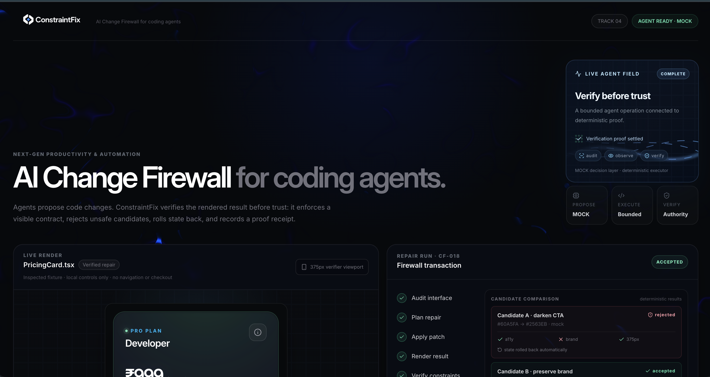
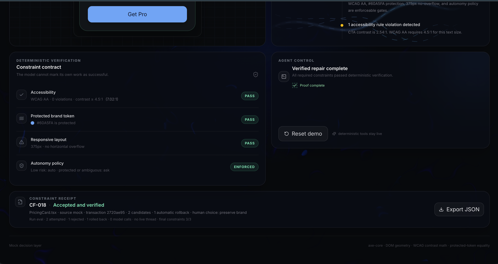

# ConstraintFix

> An agentic change-review and repair workflow for coding agents. Built for Track 04: Next-Gen Productivity & Automation at the Codex Community Hackathon — Calicut.

## Overview

ConstraintFix is an **AI Change Firewall** for frontend work produced by coding agents. It reviews a three-file React change as one transaction, renders the result, measures it against a persistent Constraint Contract, rejects unsafe work, restores the previous state, requests human judgment only when policy requires it, and verifies a revised repair before producing an auditable receipt.

The default demo runs without an API key: **planner decisions are replayed, while state changes, browser rendering, verification, rollback, and receipt generation execute live.**

## Problem Statement

Coding agents can generate multi-file frontend changes quickly, but developers still repeat the same review loop afterward:

1. Inspect every affected component.
2. Test accessibility and contrast.
3. Check design-system and protected-brand rules.
4. Inspect mobile behavior and overflow.
5. Identify regressions and revert unsafe work.
6. Explain failures, request another repair, and retest.
7. Document why the final change is safe.

A change can look successful while silently breaking an unrelated accessibility rule, protected token, or responsive layout. Letting the same model that proposed a change declare it safe is not independent verification.

## Solution

ConstraintFix wraps an agent proposal in a bounded, observable workflow:

```text
Goal → Plan → Apply → Render → Verify → Reject → Roll back
     → Human policy → Replan from measured feedback → Re-verify → Receipt
```

Providers can propose only validated operations. They cannot alter the Constraint Contract or set PASS/FAIL results. ConstraintFix independently measures the rendered browser using axe-core, contrast math, computed styles, and DOM geometry. A hard failure rejects the whole change set and restores all three fixtures atomically. Protected product policy is escalated to a person; routine repairs stay automated.

## Features

- **Agentic review run:** a visible goal, operational plan, real tool calls, observations, decisions, replan, and completion trace.
- **Multi-file atomic transaction:** PricingCard, MobileHeader, and CheckoutForm changes are accepted or rejected together.
- **Deterministic verification:** live axe-core checks, WCAG contrast calculation, protected `#60A5FA` equality, and 375px overflow measurement.
- **Automatic rollback:** rejected work restores a saved React-state snapshot and immediately re-verifies the baseline.
- **Selective human escalation:** only protected-brand judgment pauses the workflow; accessibility and responsive repairs remain autonomous.
- **Feedback-driven replan:** the actual failed matrix and human choice are passed into the selected AgentProvider.
- **Machine-readable receipt:** schema v4 records the contract, candidates, measurements, rollback proof, policy choice, AgentRun trace, and final gate result.
- **Offline-first demo:** bundled replay guarantees the judge flow with zero model calls; MOCK and an optional live planner use the same executor and verifier.
- **Premium responsive UI:** supplied ConstraintFix branding, Ferrofluid background, LiquidMetal and Gradient controls, MagicBento glow, and reduced-motion support.

## Tech Stack

- **Frontend:** React 18, Vite, TypeScript, Tailwind CSS v4, shadcn-style component structure
- **Backend:** Optional Vercel Node function for live planner requests
- **Database:** None — this hackathon MVP is intentionally stateless
- **APIs / Services:** OpenAI Responses API (optional live planner), axe-core (deterministic accessibility verification)
- **Hosting / Deployment:** Vercel
- **Other Tools:** Codex, GSAP, OGL, Paper Design shaders, Lucide React, Node test runner

## Codex / OpenAI Usage

Codex was used throughout the hackathon for:

- refining the product concept and Track 04 positioning;
- planning the transaction, provider, verifier, and UI architecture;
- implementing and refactoring React and TypeScript components;
- building the Constraint Contract and deterministic verification paths;
- debugging Vite, Tailwind, shader, runtime, responsive, and deployment issues;
- writing focused tests and repeatedly exercising both human-decision paths in a browser;
- improving UI/UX, motion, documentation, demo pacing, and failure handling;
- integrating an optional server-side OpenAI Responses API provider with structured, allowlisted operations.

At runtime, Codex/OpenAI is the **planner**, not the authority. The planner proposes; deterministic tools act; ConstraintFix decides from measured evidence. The guaranteed submission mode uses audited bundled decisions and makes zero model calls. Optional live mode sends the same structured verifier feedback to OpenAI without exposing the API key to the browser.

## Demo

### Live Demo

**[https://constraintfix.vercel.app/](https://constraintfix.vercel.app/)**

### Demo / Pitch Video

**[Watch the ConstraintFix demo / pitch video](https://drive.google.com/file/d/1y190CKQP15SIonErRkP9Pm8C0Mr_wXT0/view?usp=sharing)**

A 90-second recording script is included in [Additional Notes](#90-second-track-04-pitch).

## Screenshots

### AI Change Firewall workspace



### Verified repair and auditable receipt



## How to Run Locally

Requirements: Node.js 20+ and npm.

```bash
git clone https://github.com/joelgjojo/constraintfix.git
cd constraintfix
npm install
npm run dev
```

Open the local URL shown by Vite and select **Start Agent Run**. The default bundled-replay demo requires no API key.

Validation commands:

```bash
npm test
npm run typecheck
npm run build
npm run preview
```

For the optional live planner, add server-only variables to `.env.local` or Vercel Project Settings:

```dotenv
OPENAI_API_KEY=your_server_only_key
OPENAI_MODEL=gpt-5-mini
VITE_AGENT_MODE=live
```

Never prefix the API key with `VITE_`; that would expose it to the client bundle. Restart the development server after changing environment variables, then explicitly select **OPTIONAL LIVE PLANNER**.

## Additional Notes

### What the demo proves

The primary **Preserve Brand** path produces these browser-measured results:

| Stage | Result | Evidence |
| --- | --- | --- |
| Safe baseline | 9/9 | Three fixtures satisfy accessibility, brand, and layout gates |
| Candidate A | 6/9 — rejected | Pricing brand changed, header measured 540px inside 375px, form label detached |
| Automatic rollback | 9/9 | All three saved fixture states restored and re-measured |
| Human policy | Preserve Brand | Product judgment supplied once; routine repair stays automated |
| Candidate B | 9/9 — accepted | Token restored, foreground repaired, mobile navigation collapsed, label associated |
| Receipt | ACCEPT | 9 passed, 0 failed, recommended exit code 0 |

The alternative **Allow Change** path remains honest: accessibility and layout pass, the protected brand gate stays failed, and the result is **8/9 with an explicit approved exception**.

### Why this is agentic

ConstraintFix is agentic because each run has a **goal, operational plan, bounded tool use, environment observations, decisions, actions, structured feedback, replanning, human escalation, verification, and completion**. It does more than report test failures: it acts by rejecting unsafe work, restoring the environment, feeding observed failures into a revised plan, executing the repair, and closing the loop with proof.

It is deliberately constrained rather than an open-ended coding agent. The architecture demonstrates selective autonomy without claiming that bundled replay is fresh model reasoning.

### Architecture

```text
AgentProvider (BUNDLED REPLAY / MOCK / OPTIONAL LIVE)
  → validated structured operations for three fixtures
  → deterministic executor and one React-state commit
  → actual browser render
  → axe + contrast math + computed token + DOM geometry
  → acceptance OR rejection + snapshot rollback
  → rollback verification → human policy → feedback-driven replan
  → final verification → receipt v4
```

Key boundaries:

- `src/agent/run.ts`: AgentRun goal, plan, real tool wrapper, observations, escalation, and replan input.
- `src/agent/types.ts`: provider contract and runtime-source types.
- `src/constraints/contract.ts`: persistent policy snapshotted into every transaction.
- `src/transactions/change-set.ts`: change set, operations, acceptance policy, rollback, and receipt schema.
- `src/transactions/use-change-transaction.ts`: phase flow, atomic render, audits, recovery, human decision, and reset.
- `src/verification/change-set.ts`: serial axe audits and per-fixture browser measurements.
- `src/components/agent-run.tsx`: operational plan, live automation trace, replan feedback, and derived summary.

Only allowlisted fixture/action combinations execute. Malformed, partial, duplicated, or out-of-policy operations are rejected before any fixture changes. Unexpected provider, render, or audit failures recover to the saved baseline when possible and cannot produce an accepted receipt.

### 90-second Track 04 pitch

| Time | Action and exact narrative |
| --- | --- |
| 0–12s | “Coding agents create frontend changes quickly. Developers still repeat the review afterward: inspect, test, catch regressions, revert, re-review, and document. ConstraintFix turns that repetitive work into an agentic change-review workflow.” |
| 12–22s | Point to Agent Goal and the operational plan; press **Start Agent Run**. “Its goal is to make this three-file change safe under the organization’s contract. It handles routine steps automatically and asks only for policy judgment.” |
| 22–40s | Point to the tool trace and evidence. “The planner proposes; tools apply all three changes and measure the browser. Pricing changes a protected color, the header overflows, and the form loses its label. Six of nine gates pass, so the entire change is rejected.” |
| 40–50s | Point to rollback proof. “It restores all three fixtures and verifies the rollback. The baseline is back to nine out of nine, so nothing unsafe is partially accepted.” |
| 50–62s | Choose **Preserve Brand**. “Only this protected-brand conflict needs a person. Keep our brand. The routine accessibility and responsive repairs stay autonomous.” |
| 62–76s | Show Replan Input and Revised Plan. “The actual verifier observations and my policy choice reach the planner together. It preserves the token, repairs the foreground, fixes mobile navigation, and restores the label. The tools execute again: nine out of nine.” |
| 76–90s | Show Automation Summary and receipt. “The run documents two candidates, one rejection, one rollback, one human escalation, and an auditable receipt. Planner decisions are replayed; tools run live. ConstraintFix automates the review loop while teams control what is allowed to land.” |

### Tests and validation

- 26 automated tests cover provider contracts, AgentRun composition, tool-order truthfulness, feedback forwarding, atomic rejection, rollback isolation, policy escalation, receipts, mutable policy comparisons, and zero-network replay.
- TypeScript typecheck and production build pass.
- Both Preserve Brand and Allow Change flows were repeatedly exercised in a production browser preview.
- The deployed Preserve Brand run records 14 completed tools, one escalation, zero model calls, and a final 9/9 gate result.

### Limitations

- The MVP operates on three controlled React fixtures and a fixed operation vocabulary; it does not yet import arbitrary repositories.
- Rollback restores the transaction’s React state snapshot, not a Git commit.
- Verification covers selected axe rules, action-surface contrast, exact protected-token equality, and 375px overflow; it is not a complete WCAG certification.
- The receipt is CI-ready data, but the current demo is not connected to a real pull-request gate.
- Optional live planning is implemented, but the zero-dependency bundled replay is the supported submission mode.

### Future plans

A GitHub/CI adapter could translate repository diffs into bounded ChangeSets, enforce receipt gate results on pull requests, and load organization-specific contracts. Those integrations are future work and are not represented as current functionality.
